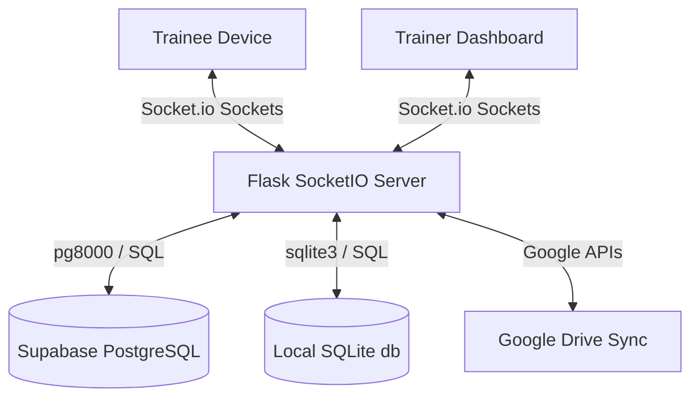

# 🔌 Project Socrates: Connection & Architecture Guide

Welcome to the **Project Socrates** connection manual. This guide explains how the **Socrates System** (Backend & Frontend) is architected, how the real-time websocket components connect, and how to run the application locally.

---

## 🏗️ System Architecture

Project Socrates is divided into two primary logical layers: the **Flask + Socket.IO Backend** and the **React + Tailwind Frontend** (served dynamically via templates).



### 1. Database Connections
The backend supports two database modes dynamically managed by the environment:
*   **PostgreSQL Mode (Production):** Triggered when the `DATABASE_URL` environment variable is defined. Automatically connects to the cloud Supabase PostgreSQL database. Includes automated port re-writing (switching from `5432` to transaction-pooler port `6543` to bypass network firewall rules on hosted environments like Render) and Eventlet-native DNS resolution bypasses.
*   **SQLite Mode (Development):** Fallback mode when no `DATABASE_URL` exists. It reads and writes to the local [socrates.db](file:///Users/diwakarsingh/Desktop/Project_Socrates_System/socrates.db) file.

### 2. Sockets & Real-time Connectivity
Real-time gamification is powered by **Flask-SocketIO** (`SocketIO` on port `5050` with CORS allowed for all origins):
*   `join_session`: Authenticates a client (Trainer or Trainee) and assigns them to a specific room matching the session's 4-digit **PIN**.
*   `trainer_broadcast`: Triggered by the Trainer to push live pre-test/post-test questions, slide changes, or language parameters to all trainees in the room.
*   `submit_vote`: Triggered by trainees to submit quiz answers. Calculates scores, response times, and broadcasts instant updates to the trainer's presenter screen.
*   `trainer_command`: Trainer triggers global actions, such as resetting session scores or triggering a full confetti podium when the session is complete.

---

## ⚡ How to Run Locally

We have already verified the python environment and started the local Flask server on your machine!

### Step 1: Start the Backend Server
The server is currently running in your terminal background via its virtual environment on **Port 5050**:
```bash
cd ~/Desktop/Project_Socrates_System
./venv/bin/python app.py
```
> [!NOTE]
> The server will output log messages about starting the Google Drive sync daemon and mounting active routes.

### Step 2: Accessing the Interfaces
Open your browser and navigate to the following local URLs:

| View | URL | Description |
| :--- | :--- | :--- |
| **Trainee Screen** | [http://127.0.0.1:5050/](http://127.0.0.1:5050/) | The mobile-optimized web app where trainees sign in, join room PINs, and answer live questions. |
| **Trainer Dashboard** | [http://127.0.0.1:5050/admin](http://127.0.0.1:5050/admin) | The administrative master dashboard to trigger quizzes, view live analytics, and manage rosters. |

---

## 🔑 Login Credentials

Use the following pre-configured credentials to log in and test the system locally:

### 1. Trainer Login (Admin Panel)
*   **URL:** [http://127.0.0.1:5050/admin](http://127.0.0.1:5050/admin)
*   **Trainer ID:** `ADMIN`
*   **Password:** `admin123`

### 2. Trainee Login
*   **URL:** [http://127.0.0.1:5050/](http://127.0.0.1:5050/)
*   **Session PIN:** Generated when starting a session inside the Admin Panel (e.g. `1234`).
*   **Search Profile:** Type `RAHUL` to find and select the pre-registered profile **Rahul Sharma** (`SF-8888`).

---

## 🛠️ Verification & Deployment Scripts
The project includes shell scripts in the [scripts/](file:///Users/diwakarsingh/Desktop/Project_Socrates_System/scripts/) folder to verify the live service health:
*   **Health Check:** Run `./scripts/check_health.sh` to ping the active Render live endpoint.
*   **Render Restart:** Run `./scripts/restart_render.sh` to trigger a manual zero-downtime service restart.
